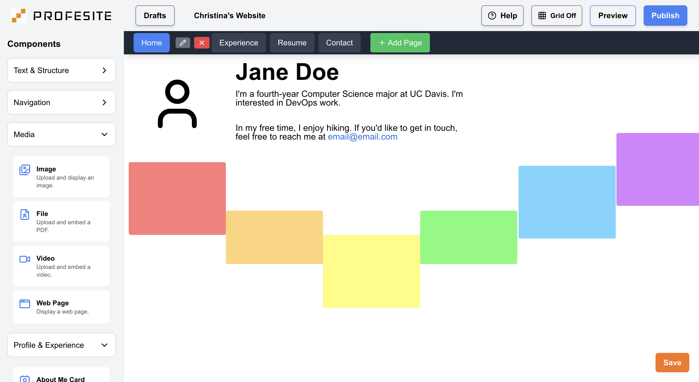
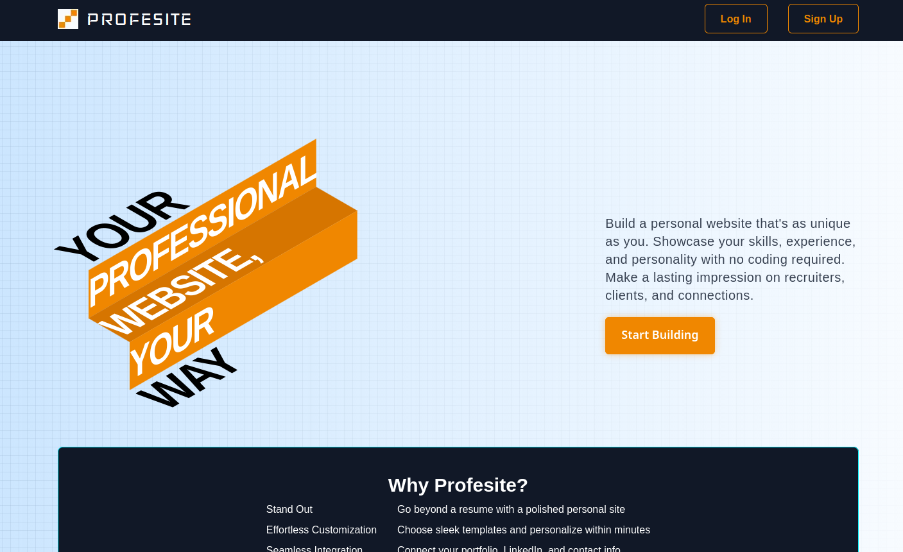
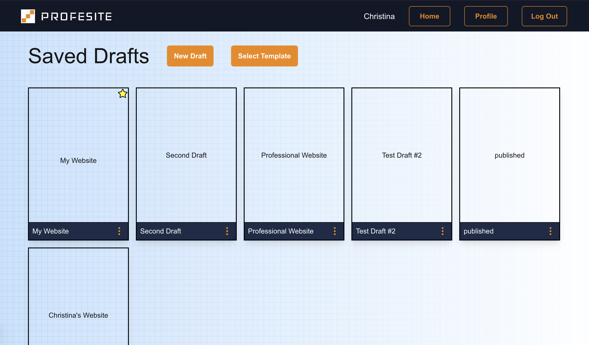
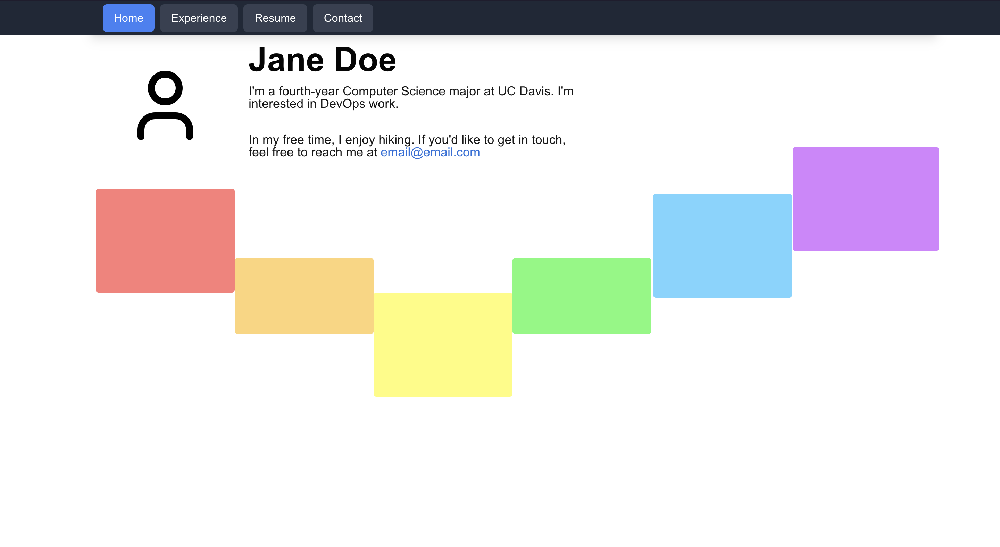
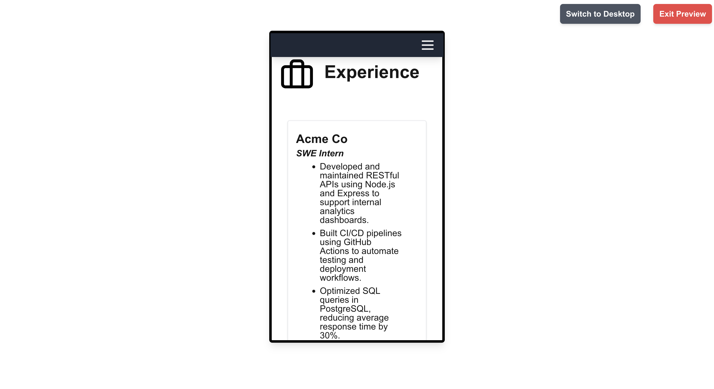

# Personal Website Template (Profesite)

A drag-and-drop personal website builder for non-technical users who want to
create, customize, and publish a professional personal website without writing a
single line of code.

> UC Davis Senior Capstone Project (ECS 193A/B)

Site: [profesite.online](https://profesite.online) *(archived)*

## Screenshots

<details open>
<summary><b>Editor</b></summary>
<br>

</details>
<details>
<summary><b>Landing Page</b></summary>
<br>

</details>
<details>
<summary><b>Saved Drafts Dashboard</b></summary>
<br>

</details>
<details>
<summary><b>Preview: Desktop</b></summary>
<br>

</details>
<details>
<summary><b>Preview: Mobile</b></summary>
<br>

</details>

## Overview

Profesite gives users a WYSIWYG canvas where they can drag, drop, resize, and
style components to build a personal website, then publish it to a live URL with
a single click. The platform handles all hosting and deployment transparently,
leaving users to focus entirely on their content.

The project was motivated by a gap in existing tools: Wix and Weebly impose
heavy branding on free tiers, LinkedIn is too rigid for personal expression, and
self-hosting has a steep technical barrier. Profesite targets the middle ground,
offering flexible customization with zero infrastructure overhead.

## Features

**Drag-and-Drop Editor** Components are dragged from a sidebar onto a freeform
canvas using dnd-kit. Once placed, every component can be freely repositioned
and resized via React-RND. A live grid overlay helps with alignment.

**Rich Text Editing** Text-based components use Lexical for inline rich text
editing with a floating toolbar that supports bold, italic, underline,
strikethrough, font size, color, alignment, and hyperlinks.

**Multi-Page Support** Users can create and manage multiple named pages within a
single draft (e.g., Home, Experience, Resume, Contact), each with its own
independent canvas.

**Draft Management** Multiple drafts can be saved per account. Users can rename,
delete, and star drafts from a dashboard view. All draft state is persisted to
Firebase Firestore.

**Media Components** Supports uploading and embedding images, PDFs, videos, and
external web pages. Uploaded files are stored in Firebase Storage and referenced
by URL within the component's content field.

**Preview & Publish** A full preview mode renders the site as visitors will see
it, with a toggle between desktop and mobile viewports. Publishing deploys the
current draft to a public URL at `profesite.online/pages/[username]/[page]`.
Users can unpublish at any time.

**Authentication** Secure sign-up and login via Firebase Authentication with
session cookies managed server-side through Next.js API routes. Route protection
is enforced via middleware.

## Tech Stack

| Layer | Technology |
|---|---|
| Framework | [Next.js](https://nextjs.org/): full-stack framework covering frontend, API routes, and SSR |
| Database | [Firebase Firestore](https://firebase.google.com/docs/firestore): NoSQL database well-suited for heterogeneous component configs |
| File Storage | Firebase Storage: stores uploaded images and PDFs, referenced by URL in component data |
| Auth | Firebase Authentication: handles login and signup with sessions managed via server-side cookies |
| Hosting | [Vercel](https://vercel.com/): native Next.js hosting with GitHub-integrated deploys |
| Drag & Drop | [dnd-kit](https://dndkit.com/): powers sidebar-to-canvas drag interaction |
| Resize/Move | [React-RND](https://github.com/bokuweb/react-rnd): freeform drag and resize for placed components |
| Rich Text | [Lexical](https://lexical.dev/): extensible rich text editor with floating toolbar |
| Styling | Tailwind CSS |

## Architecture

```
┌─────────────────────────────────────────────┐
│              Next.js Application             │
│  ┌──────────────┐    ┌──────────────────┐   │
│  │  Frontend    │    │  API Routes      │   │
│  │  (React/TSX) │◄──►│  (Backend Logic) │   │
│  └──────────────┘    └────────┬─────────┘   │
└───────────────────────────────│─────────────┘
                                │
              ┌─────────────────┼──────────────────┐
              ▼                 ▼                   ▼
   ┌──────────────────┐  ┌───────────┐   ┌──────────────────┐
   │ Firebase Auth    │  │ Firestore │   │ Firebase Storage  │
   │ (User sessions)  │  │ (Configs) │   │ (Images / Files)  │
   └──────────────────┘  └───────────┘   └──────────────────┘
```

### Data Model

**`users/{userId}`**
```
email: String
username: String
publishDraftId: String
draftMappings: [{ id: Number, name: String }]
```

**`drafts/{draftId}`**
```
draftId: String
views: Number
pages: Page[]
  └─ pageName: String
     components: Component[]
       └─ componentId: String
          componentType: String
          content: String        // text content or Firebase Storage URL
          position: { x, y }
          size: { width, height }
```

Website configurations are intentionally schema-flexible: each component type
stores whatever it needs in a generic `content` field, which is why NoSQL was
chosen over a relational database.

### Published Site Routing

Published sites are served via Next.js dynamic routing at
`/pages/[username]/[page]`, so every user gets a public URL immediately on
publish with no additional deployment step.

## Getting Started

### Prerequisites
- Node.js 18+
- A Firebase project with Firestore, Storage, and Authentication enabled

### 1. Clone the repo

```bash
git clone https://github.com/UCD-193AB-ws24/personal-website-template
cd personal-website-template
```

### 2. Configure environment variables

Create a `.env.local` file in the project root:

```env
NEXT_PUBLIC_FIREBASE_API_KEY=       # Firebase project settings -> Web API Key
NEXT_PUBLIC_FIREBASE_APP_ID=        # Firebase project settings -> App ID
FIREBASE_SERVICE_ACCOUNT_KEY=       # Firebase → Service accounts -> Generate new private key (paste full JSON)
NEXT_PUBLIC_URL=http://localhost:3000
```

### 3. Install and run

```bash
npm install
npm run dev
```

The app will be available at `http://localhost:3000`.

### Scripts

```bash
npm run dev       # Start development server
npm run build     # Production build
npm run test      # Run Vitest test suite
npm run lint      # ESLint
npm run format    # Prettier
```

## Project Structure

```
src/
├── app/
│   ├── api/              # All Next.js API route handlers
│   ├── editor/           # /editor page
│   ├── login/            # /login page
│   ├── signup/           # /signup page
│   ├── saveddrafts/      # /saveddrafts page
│   ├── pages/
│   │   └── [username]/[page]/   # Dynamic routing for published sites
│   └── page.tsx          # Landing page (/)
├── components/
│   └── editorComponents/ # All draggable/droppable editor components
├── contexts/             # React Contexts for editor, pages, and publishing state
├── customTypes/          # TypeScript interfaces (component data, API responses)
├── lib/                  # Firebase config, custom hooks, API request helpers
├── utils/                # Drag/resize utilities, validation, constants
└── middleware.ts          # Route protection and auth redirects
```

## API Reference

All routes are under `/api/`. Auth state is managed via session cookies set at login.

| Method | Path | Description |
|---|---|---|
| `POST` | `/api/auth/login` | Log in, set session cookie |
| `GET` | `/api/auth/signout` | Log out, destroy session cookie |
| `GET` | `/api/user/get-drafts` | List all draft IDs and names for the current user |
| `POST` | `/api/user/update-drafts` | Create a new draft document |
| `POST` | `/api/user/delete-draft` | Delete a draft by ID |
| `POST` | `/api/user/rename-draft` | Rename a draft |
| `GET` | `/api/db/drafts?draftNumber=num` | Fetch saved components for a draft |
| `POST` | `/api/db/drafts?draftNumber=num` | Save component state for a draft |
| `POST` | `/api/user/publish-draft` | Publish a draft to the public URL |
| `POST` | `/api/user/unpublish-draft` | Unpublish, making the site private |
| `GET` | `/api/db/drafts/published-draft?username=str` | Fetch components for a user's published site |
| `POST` | `/api/db/drafts/increase-view-count?username=str` | Increment view counter |
| `GET` | `/api/user/get-published-views` | Get current view count |
| `GET` | `/api/db/templates/get` | Fetch available pre-built templates |
| `POST` | `/api/user/change-username` | Update username |

## Team

| Name | GitHub |
|---|---|
| Christina Phan | [@christinaphan](https://github.com/christinaphan) |
| Christopher Phan | [@chris-phan](https://github.com/chris-phan) |
| Hanson Lau | [@HansonKLau](https://github.com/HansonKLau) |
| Lauren Mandell | [@laurenmandell](https://github.com/laurenmandell) |
